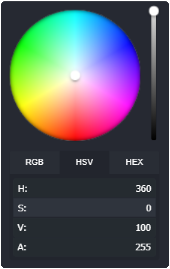
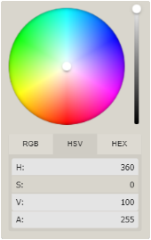

<h3 align="center">
    Flat and simple color-picker
</h3>

<p align="center">
    
    
    
    
    <a href="https://github.com/sponsors/ivanvmat"></a>
</p>

<br>

<h3 align="center">
    
</h3>

<h4 align="center">
    <a href="https://ivanvmat.github.io/color-picker/">Fully Featured demo</a>
</h4>

### Features
* Simple: The interface is straight forward and easy to use.
* Practical: Multiple color representations. Multiple themes.
* Mobile-friendly: Works well on mobile devices and touch screens.
* No dependencies

### Themes
|Dark|Light|
|----|-----|
|||

### Getting Started
> Note: The readme is always up-to-date with the latest commit. See [Releases](https://github.com/ivanvmat/color-picker/releases) for installation instructions regarding to the latest version.

#### Browser
```html

<link rel="stylesheet" href="dist/color-picker.min.css"/>
<script type="text/javascript" src="dist/color-picker.min.js"></script>
```

### Usage
```javascript
// Simple example, see optional options for more configuration.
const picker = new ColorPickerControl({ 
    container: document.body, 
    theme: 'dark' 
});
```

> You can find more examples [here](EXAMPLES.md).

## Events
Use the `on(event, cb)` and `off(event, cb)` functions to bind / unbind eventlistener.

| Event      | Description | Arguments |
| -------------- | ----------- | --------- |
| `init`         | Initialization done - color picker can be used | `ColorPickerControlInstance` |
| `open`         | Color picker got opened | `ColorPickerControlInstance` |
| `change`       | Color has changed | `HSVaColorObject` |
| `close`        | Color picker got closed | `ColorPickerControlInstance` |

> Example:
```js
picker.on('init', (instance) => {
    console.log('Event: "init"', instance);
});
picker.on('open', (instance) => {
    console.log('Event: "open"', instance);
});
picker.on('change', (color) => {
    console.log('Event: "change"', color);
});
picker.on('close', (instance) => {
    console.log('Event: "close"', instance);
});
```
